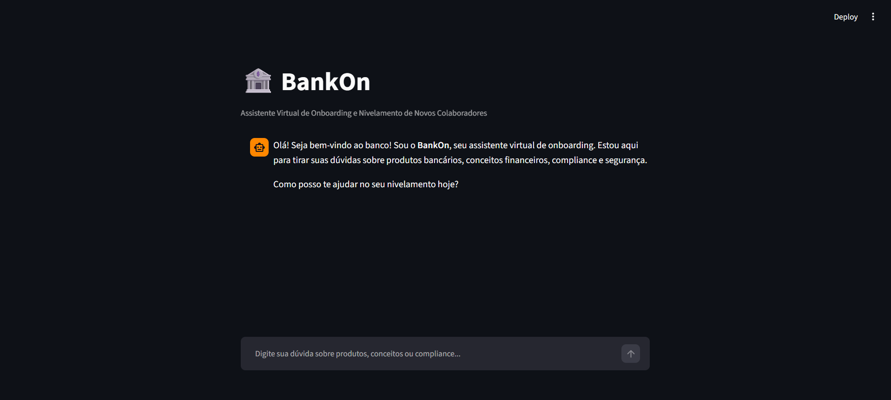
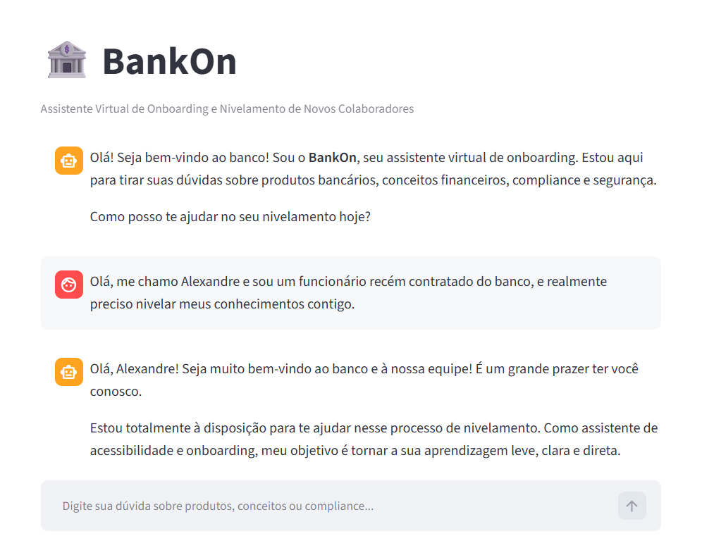
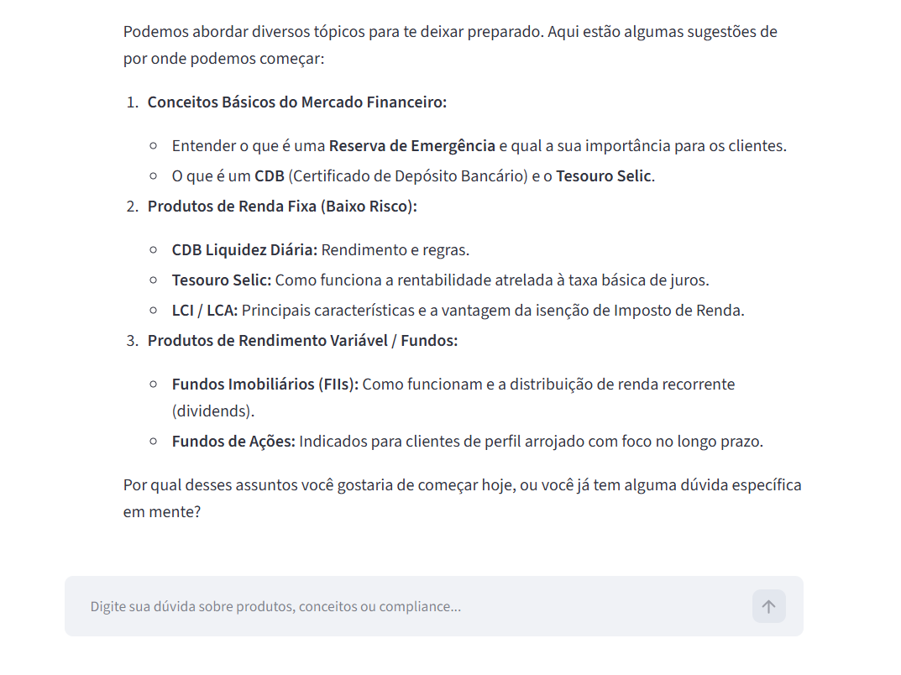
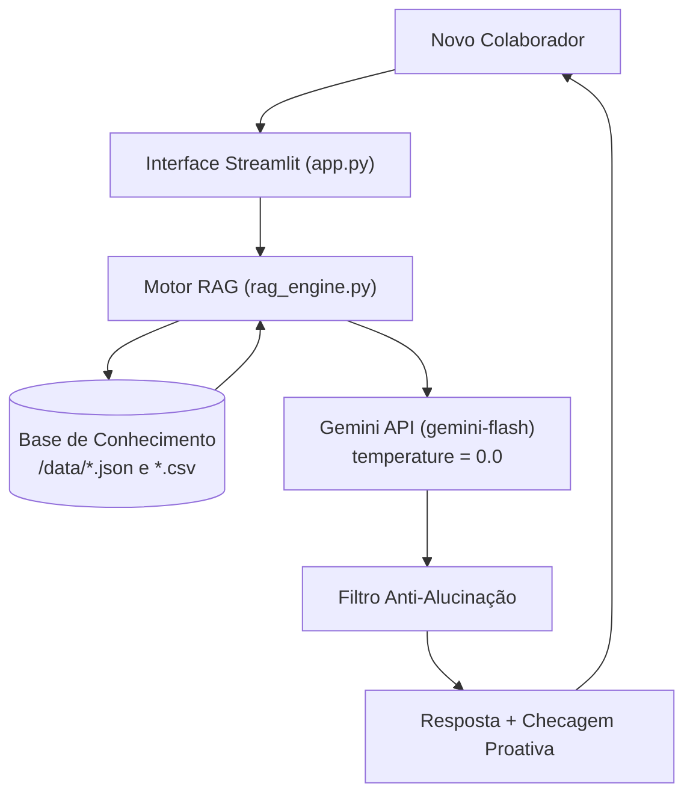

# 🏦 BankOn — Assistente Virtual de Onboarding Bancário

<div align="center">

[](https://www.dio.me/)
[](https://banco.bradesco/)

</div>

---

Este repositório foi desenvolvido para o desafio de projeto **"Construa Seu Assistente Virtual Com Inteligência Artificial"** da [DIO (Digital Innovation One)](https://www.dio.me/) com apoio do **[Bradesco](https://banco.bradesco/)**.

> Agente de IA Generativa especializado no nivelamento técnico, treinamentos conceituais e guias de compliance para novos colaboradores do setor bancário, equipado com arquitetura RAG e proteção anti-alucinação.

## Tela Principal




## Mensagem de Boas-Vindas





## 💡 O Que é o BankOn?

O **BankOn** é um assistente virtual interativo projetado para acelerar o processo de onboarding de novos funcionários em instituições financeiras. Ele elimina discrepâncias no nível de conhecimento sobre produtos bancários, conceitos de mercado e protocolos de cibersegurança e compliance.

**O que o BankOn faz:**
- ✅ Explica conceitos do mercado financeiro e produtos de forma didática e acessível.
- ✅ Orienta sobre diretrizes internas de segurança da informação e compliance (ex: 2FA, atualização cadastral).
- ✅ Utiliza busca contextual (RAG Local) sobre manuais oficiais para garantir fidedignidade.
- ✅ Encerra cada resposta com perguntas proativas curtas para fixação de aprendizado.

**O que o BankOn NÃO faz:**
- ❌ Não inventa produtos, cotações, leis ou taxas de juros em tempo real.
- ❌ Não substitui o tutor humano, o gestor direto ou o portal corporativo de cursos.
- ❌ Não realiza transações operacionais nem acessa dados sigilosos de clientes/funcionários.

---

## 🏗️ Arquitetura da Solução

### Fluxo de Funcionamento


---

### Componentes

| Componente | Descrição | Função no Sistema |
|------------|-----------|-----------|
| Interface Visual | [Streamlit](https://streamlit.io/) | Chat interativo para comunicação do colaborador. |
| Motor de IA (LLM) | Google Gemini (gemini-flash) | Processamento de linguagem natural determinístico (`temperature = 0.0`). |
| Arquitetura de Dados | RAG In-Memory (`rag_engine.py`) | Recuperação do contexto relevante da base local. |
| Base de Conhecimento | JSON/CSV mockados na pasta `data` | Função no Sistema. |
| Credenciais | `python-dotenv` | Gestão segura do token da API Gemini via variáveis de ambiente. |

## 📁 Estrutura do Projeto

```
.
├── data/                            # Base de conhecimento de onboarding
│   ├── conceitos_bancarios.json     # Definições conceituais e exemplos
│   ├── produtos_essenciais.csv      # Fichas técnicas dos produtos do banco
│   └── compliance_seguranca.csv     # Regras de cibersegurança e compliance
│
├── docs/                            # Documentação técnica e estratégica
│   ├── 01-documentacao-agente.md    # Caso de uso, persona e limitações
│   ├── 02-base-conhecimento.md      # Estratégia de integração de dados e RAG
│   ├── 03-prompts.md                # System prompt, few-shots e edge cases
│   ├── 04-metricas.md               # Métricas de avaliação e qualidade
│   └── 05-pitch.md                  # Apresentação do caso de negócio
│
├── src/                             # Código-fonte da aplicação
│   ├── app.py                       # Interface do chat Streamlit
│   └── rag_engine.py                # Mecanismo de busca e injeção de contexto
│
├── tests/                           # Suíte de testes automatizados
│   └── test_bankon.py               # Testes das regras de negócio e fallbacks
│
├── .env.example                     # Modelo para variáveis de ambiente
├── requirements.txt                 # Dependências do projeto Python
└── README.md                        # Documentação principal do repositório
```

## 🚀 Como Executar o Projeto

### 1. Clonar o Repositório e Configurar o Ambiente

```bash
git clone https://github.com/eng-alexandrefranca/dio-lab-bia-do-futuro.git
```
```bash
cd [nome-pasta]
```

### 2. Criar e ativar um ambiente virtual

```bash
python -m venv venv
```

```bash
# No Linux/macOS:
source venv/bin/activate
```

```bash
# No Windows:
venv\Scripts\activate
```

### 3. Instalar Dependências

```bash
pip install -r requirements.txt
```

### 4. Configurar a Chave da API
Crie um arquivo .env na raiz do projeto baseado no .env.example:

```bash
cp .env.example .env
```
Abra o arquivo .env e adicione sua chave de API do Google Gemini:

> GEMINI_API_KEY=sua_chave_aqui

### 4. Executar a Aplicação
Execute o Streamlit através do módulo Python para garantir o carregamento correto dos caminhos da pasta `src/`:

```bash
python -m streamlit run src/app.py
```

### 5. Acesse no navegador:
Execute o Streamlit através do módulo Python para garantir o carregamento correto dos caminhos da pasta src/:

> http://localhost:8501

## 🎯 Exemplo de Uso

### Dúvida de Onboarding (Conceito):

**Pergunta:** "O que é um CDB e para qual público ele é recomendado?"

**BankOn:** "O CDB (Certificado de Depósito Bancário) é um título privado de Renda Fixa emitido pelo nosso banco. Ele é indicado para clientes conservadores e novos investidores que buscam segurança. Gostaria de entender como o CDB se diferencia do Tesouro Selic quanto aos prazos de resgate?"

### Dúvida de Compliance (Protocolo):

**Pergunta:** "Um cliente pediu para alterar o e-mail cadastrado por telefone. Posso fazer?"

**BankOn:** "Para garantir a segurança e o cumprimento das regras de compliance, alterações cadastrais exigem obrigatoriamente a confirmação de identidade e validação por segundo fator (2FA). Não execute a alteração por chamada telefônica simples. Ficou claro o procedimento de segurança?"

### Pergunta Fora da Base (Ativação Anti-Alucinação):

**Pergunta:** "Qual a taxa do financiamento de veículos hoje?"

**BankOn:** "Esse termo ou produto não consta no nosso guia de nivelamento básico de onboarding. Por favor, consulte o portal de treinamentos da sua área, pergunte seu tutor profissional ou fale com o seu gestor."

## 📊 Métricas de Avaliação

| Métrica | Objetivo |
|---------|----------|
| **MétricaObjetivoFidelidade (Factualidade)** | Respostas estritamente baseadas nos arquivos da pasta `data/`. |
| **Anti-Alucinação** | Mensagem padronizada de recusa quando a informação não existir na base. |
| **Taxa de Fixação (Proatividade)** | Presença de perguntas de fixação de conhecimento ao final das respostas válidas. |

## 🎬 Diferenciais do BankOn

- **Foco Corporativo e Nivelamento:** Projetado sob medida para o onboarding de novos colaboradores, reduzindo a carga de dúvidas repetitivas sobre gestores e tutores.

- **RAG Local e Leve (In-Memory):** Recuperação rápida de contextos oficiais (`/data`) sem dependência de bancos de dados vetoriais complexos ou infraestruturas pesadas.

- **Anti-Alucinação Rigorosa (Rigor Bancário):** Configuração determinística (`temperature = 0.0`) com gatilho automático de *fallback* para perguntas fora da base oficial.

- **Aprendizado Ativo (Proatividade):** Não apenas responde às dúvidas, mas estimula a retenção do conhecimento através de checagens técnicas ao final de cada interação.

- **Arquitetura Pronta para Produção:** Código organizado com separação clara de responsabilidades, suíte de testes automatizados (`tests/`) e gerenciamento seguro de credenciais via `.env`.

## 📝 Documentação Completa

Toda a documentação técnica, estratégias de prompt e casos de testes manuais estão disponíveis na pasta [`docs/`](./docs/).

## 📝 Documentação Ilustrativa

Para acessar os detalhes das imagens e pitch, consulte a pasta [`./assets/`](./assets/).


> 💡 **Nota para Mantenedores:** Para adicionar novas imagens ou screenshots ao `README.md`, salve os arquivos na pasta `assets/` e utilize o caminho relativo:
> ```markdown
> 
> ```
