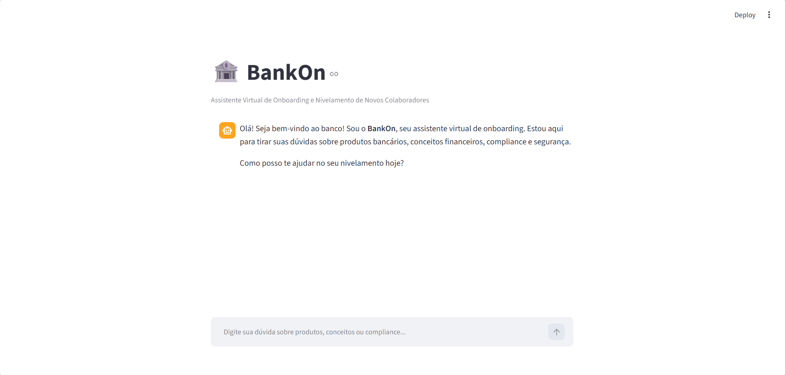
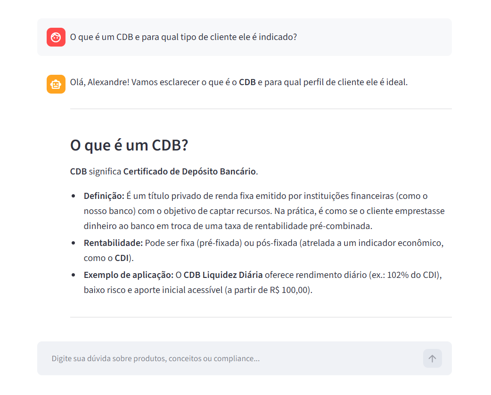
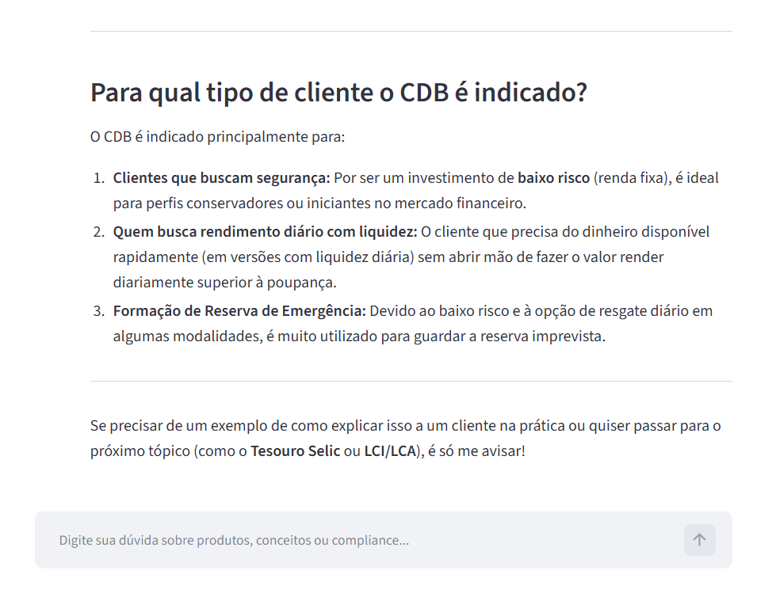
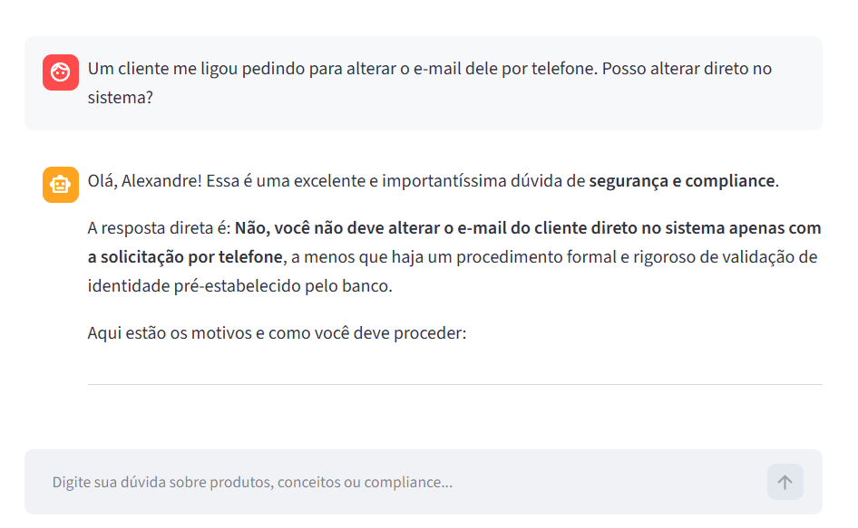
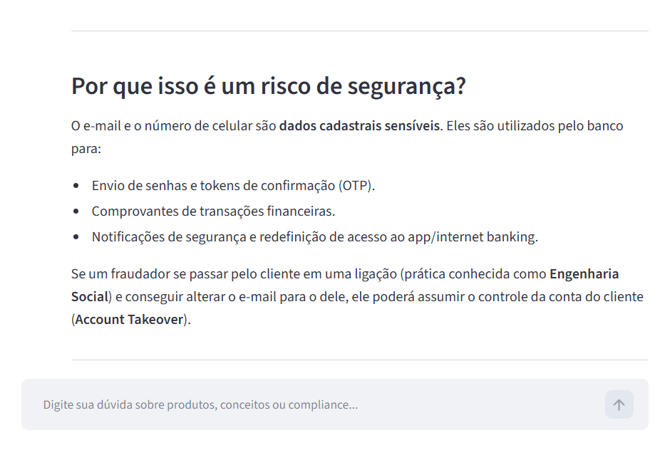
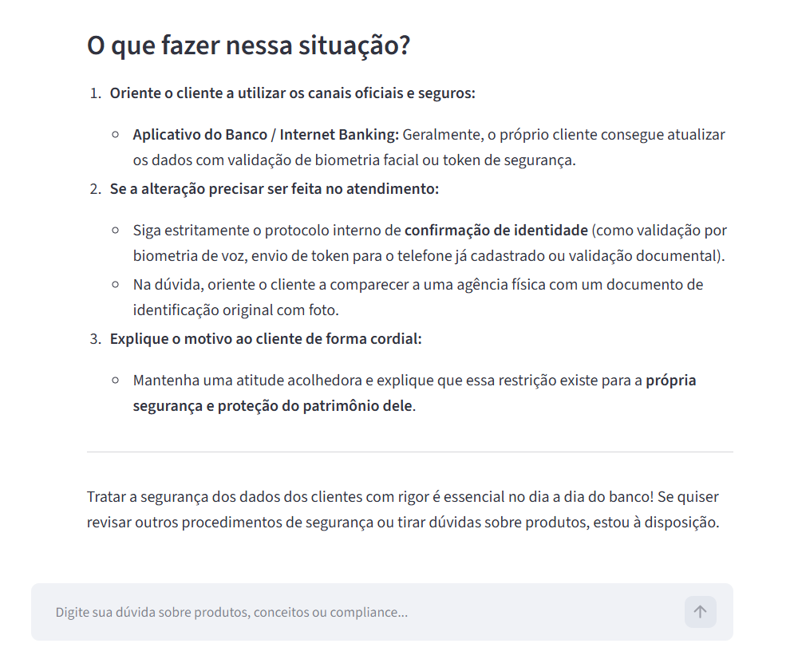
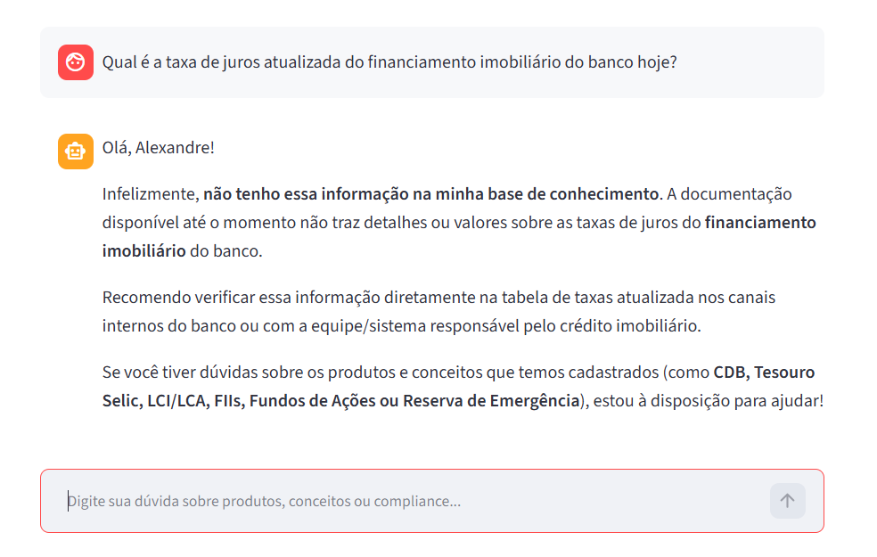
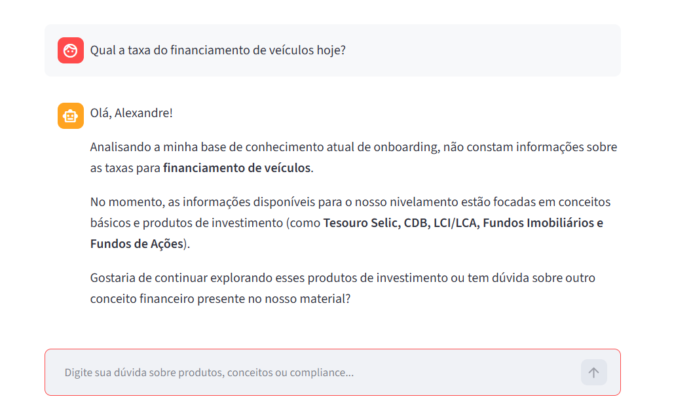

# 🎨 Assets do Projeto — BankOn

Esta pasta centraliza todos os recursos visuais, diagramas e evidências do **BankOn** utilizados na documentação do projeto e no `README.md`.

## 📁 Estrutura de Arquivos

Abaixo estão os arquivos sugeridos para organizar a pasta `assets/`:

```text
assets/
├── arquitetura-bankon.png     # Diagrama visual da arquitetura (RAG + Streamlit + Gemini)
├── screenshot-chat.png        # Print da tela principal do chat interativo
├── screenshot-compliance.png  # Print da resposta do agente para dúvidas de compliance/2FA
├── screenshot-fallback.png    # Print do teste de anti-alucinação (mensagem de recusa)
├── logo-bankon.png            # (Opcional) Logo ou banner para o topo do README
└── README.md                  # Este guia
```
## Tela Principal



## Tela de Boas-Vindas


## Interações

### Cenário 1: Dúvida sobre Conceito e Produto (Fluxo Principal)

**Contexto:** Novo colaborador perguntando sobre aplicação de Renda Fixa contida nos arquivos

**Usuário:**
```
O que é um CDB e para qual tipo de cliente ele é indicado?
```

**Agente:**





---

### Cenário 2: Consulta de Procedimento de Compliance e Segurança

**Contexto:** Colaborador em dúvida sobre procedimento de atualização de dados com base em `compliance_seguranca.csv`.

**Usuário:**
```
Um cliente me ligou pedindo para alterar o e-mail dele por telefone. Posso alterar direto no sistema?
```

**Agente:**







---

## Edge Cases

### 1.a Perguntas fora do escopo ou produto não cadastrado (Ativação Anti-Alucinação)

**Usuário:**
```
Qual é a taxa de juros atualizada do financiamento imobiliário do banco hoje?
```

**Agente:**




### 1.a Perguntas fora do escopo ou produto não cadastrado (Ativação Anti-Alucinação)

**Usuário:**
```
Qual a taxa do financiamento de veículos hoje?
```

**Agente:**



---

### 2. Sugestões de Segurança da IA

#### Cenário A

![Resposta do Cenário 5 [Extra] - Parte 01)](./Screenshot_Interacao-cenario05extra-parte01.png)

![Resposta do Cenário 5 [Extra] - Parte 02)](./Screenshot_Interacao-cenario05extra-parte02.png)

![Resposta do Cenário 5 [Extra] - Parte 03)](./Screenshot_Interacao-cenario05extra-parte03.png)

![Resposta do Cenário 5 [Extra] - Parte 04)](./Screenshot_Interacao-cenario05extra-parte04.png)

![Resposta do Cenário 5 [Extra] - Parte 05)](./Screenshot_Interacao-cenario05extra-parte05.png)

#### Cenário B

![Resposta do Cenário 6 [Extra] - Parte 01)](./Screenshot_Interacao-cenario06extra-parte01.png)

![Resposta do Cenário 6 [Extra] - Parte 02)](./Screenshot_Interacao-cenario06extra-parte02.png)

![Resposta do Cenário 6 [Extra] - Parte 03)](./Screenshot_Interacao-cenario06extra-parte03.png)

![Resposta do Cenário 6 [Extra] - Parte 04)](./Screenshot_Interacao-cenario06extra-parte04.png)

![Resposta do Cenário 6 [Extra] - Parte 05)](./Screenshot_Interacao-cenario06extra-parte05.png)

![Resposta do Cenário 6 [Extra] - Parte 06)](./Screenshot_Interacao-cenario06extra-parte06.png)

![Resposta do Cenário 6 [Extra] - Parte 07)](./Screenshot_Interacao-cenario06extra-parte07.png)

![Resposta do Cenário 6 [Extra] - Parte 08)](./Screenshot_Interacao-cenario06extra-parte08.png)

---

## 📝 Documentação Detalhada

Para acessar os detalhes de arquitetura, estratégia de prompts e pitch, consulte a pasta [`docs/`](./docs/).


> 💡 **Nota para Mantenedores:** Para adicionar novas imagens ou screenshots ao `README.md`, salve os arquivos na pasta `assets/` e utilize o caminho relativo:
> ```markdown
> 
> ```