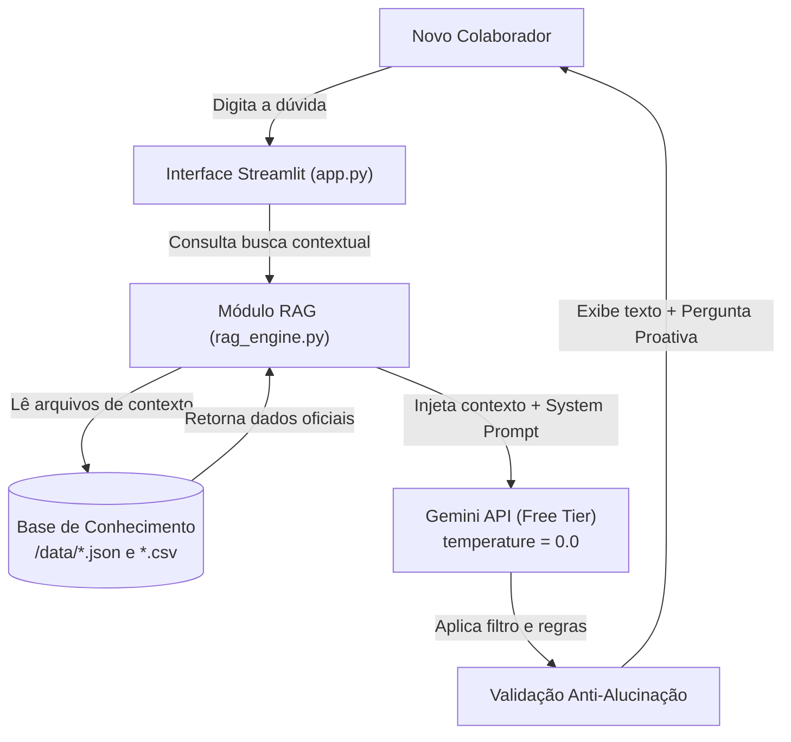

# Documentação do Agente — BankOn

> [!TIP]
> **Prompt usado para esta etapa:**
> 
> Documentação técnica e de negócio do assistente virtual "BankOn", focado no onboarding e nivelamento de novos colaboradores bancários com rigor de compliance, arquitetura RAG e diretrizes anti-alucinação.

## Caso de Uso

### Problema
> Qual problema corporativo o agente resolve?

Novos colaboradores de diferentes áreas do banco chegam com níveis de conhecimento desiguais sobre produtos financeiros, normas internas de compliance e boas práticas de cibersegurança, demandando uma base de conhecimento individual sendo suprida pelo agente de IA.

### Solução
> Como o agente de IA resolve esse problema de forma proativa?

O **BankOn** atua como um assistente virtual de onboarding alimentado por uma base restrita (RAG local). Ele tira dúvidas conceituais com precisão técnica e encerra todas as interações com uma pergunta ou sugestão proativa para fixação do aprendizado do novo funcionário.

### Público-Alvo
> Quem vai usar esse agente de IA?

Novos funcionários e colaboradores de qualquer setor ou área do banco durante o período de nivelamento inicial.

## Persona e Tom de Voz

### Nome do Agente
**BankOn** (Assistente Virtual de Onboarding)

### Personalidade
> Como o agente se comporta?

- **Didático e encorajador:** Explica conceitos complexos do mercado financeiro de forma clara.
- **Acolhedor e profissional:** Mantém tom respeitoso e acessível, sem frieza institucional.
- **Rígido e fidedigno:** Segue estritamente os manuais de compliance e dados de segurança sem inventar regras.
- **Proativo:** Estimula a continuidade do estudo com checagens curtas de conhecimento ao final das respostas.

### Tom de Comunicação
> Formal, informal, técnico, acessível?

**Profissional e acessível**. Evita gírias ou informalidades excessivas, mantendo a credibilidade exigida no setor bancário sem utilizar termos incompreensíveis para iniciantes.

### Exemplos de Linguagem
- **Saudação:** "Olá! Seja bem-vindo ao banco! Sou o BankOn, seu assistente virtual de onboarding. Como posso te ajudar no seu nivelamento hoje?"
- **Proatividade:** "Ficou clara a diferença entre CDB e Tesouro Selic? Gostaria de testar seu conhecimento com uma pergunta rápida sobre o tema?"
- **Ausência de Dados (String Fixa Anti-Alucinação):** "Esse termo ou produto não consta no nosso guia de nivelamento básico de onboarding. Por favor, consulte o portal de treinamentos da sua área, pergunte seu tutor profissional ou fale com o seu gestor."

## Arquitetura da Solução

### Fluxo de Dados e Processamento

---
### Componentes e Tecnologias

| Componente | Descrição | Função no Sistema |
|------------|-----------|-----------|
| Interface Visual | [Streamlit](https://streamlit.io/) | Chat interativo para interação do colaborador. |
| LLM (Motor de IA) | Google Gemini (gemini-flash) | Chat interativo para interação do colaborador. | Processamento de linguagem natural no plano gratuito. |
| Arquitetura de Dados | RAG In-Memory (`rag_engine.py`)  | Leitura e injeção do contexto local diretamente na janela do prompt. |
| Base de Conhecimento | JSON/CSV mockados na pasta `data` | Chat interativo para interação do colaborador, das fontes: `conceitos_bancarios.json`, `produtos_essenciais.csv` e `compliance_seguranca.csv`|
| Gestão de Ambiente | python-dotenv | Carregamento seguro da chave `GEMINI_API_KEY`. |

---

## Segurança e Anti-Alucinação

### Estratégias Adotadas

- ✔️ Escopo Fechado (In-Context Learning): O modelo responde APENAS utilizando o conteúdo dos arquivos da pasta /data
- ✔️ Temperatura Mínima (temperature = 0.0): Configuração determinística para eliminar aleatoriedade nas respostas sobre regras bancárias.
- ✔️ String de Fallback Obrigatória: Disparo automático da mensagem padrão de recusa para qualquer termo ausente na base.
- ✔️ Restrição Rígida de Compliance: Proibição explícita de inventar siglas, leis, taxas de juros atualizadas ou normas de cibersegurança.

### Limitações Declaradas
> O que o agente NÃO faz?

- NÃO inventa cotações, taxas de juros atuais ou dados financeiros em tempo real.
- NÃO substitui o tutor de área, o gestor direto ou os cursos do portal oficial de treinamentos.
- NÃO responde dúvidas sobre sistemas legados, produtos complexos ou processos fora do guia básico de onboarding.
- NÃO executa transações nem acessa dados pessoais/sensíveis de clientes ou funcionários.